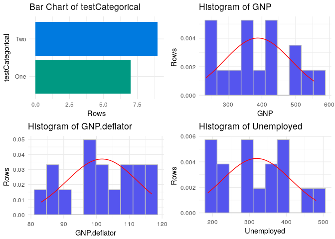

<!-- README.md is generated from README.Rmd. Please edit that file -->
xray
====

[](https://travis-ci.org/sicarul/xray)

The R Package to have X Ray vision on your datasets. This package lets you analyze the variables of a dataset, to evaluate how is the shape of your data. Consider this the first step when you have your data for modeling, you can use this package to analyze all variables and check if there is anything weird worth transforming or even avoiding the variable altogether.

Installation
------------

You can install xray from github with:

``` r
# install.packages("devtools")
devtools::install_github("sicarul/xray")
```

Usage
-----

### Anomaly detection

`xray::anomalies` analyzes all your columns for anomalies, whether they are NAs, Zeroes, Infinite, etc, and warns you if it detects variables with at least 80% of rows with those anomalies. It also warns you when all rows have the same value.

Example:

``` r
data(longley)
badLongley=longley
badLongley$GNP=NA
xray::anomalies(badLongley)
#> Warning in xray::anomalies(badLongley): Found 1 possible problematic variables: 
#> GNP
#> $variables
#>       Variable  q qNA  pNA qZero pZero qBlank pBlank qInf pInf qDistinct
#> 1          GNP 16  16 100%     0     -      0      -    0    -         1
#> 2 GNP.deflator 16   0    -     0     -      0      -    0    -        16
#> 3   Unemployed 16   0    -     0     -      0      -    0    -        16
#> 4 Armed.Forces 16   0    -     0     -      0      -    0    -        16
#> 5   Population 16   0    -     0     -      0      -    0    -        16
#> 6         Year 16   0    -     0     -      0      -    0    -        16
#> 7     Employed 16   0    -     0     -      0      -    0    -        16
#>      type anomalous_percent
#> 1 Logical              100%
#> 2 Numeric                 -
#> 3 Numeric                 -
#> 4 Numeric                 -
#> 5 Numeric                 -
#> 6 Integer                 -
#> 7 Numeric                 -
#> 
#> $problem_variables
#>   Variable  q qNA  pNA qZero pZero qBlank pBlank qInf pInf qDistinct
#> 1      GNP 16  16 100%     0     -      0      -    0    -         1
#>      type anomalous_percent
#> 1 Logical              100%
#>                                                              problems
#> 1 Anomalies present in 100% of the rows. Less than 2 distinct values.
```

### Distributions

`xray::distributions` tries to analyze the distribution of your variables, so you can understand how each variable is statistically structured. It also returns a percentiles table of numeric variables as a result, which can inform you of the shape of the data.

``` r
distrLongley=longley
distrLongley$testCategorical=c(rep('One',7), rep('Two', 9))
xray::distributions(distrLongley)
#> ===========================================================================
```



    #>       Variable      p_1     p_10     p_25     p_50     p_75    p_90
    #> 1 GNP.deflator    83.78    88.35   94.525    100.6   111.25  114.95
    #> 2          GNP 237.8537   258.74  317.881  381.427 454.0855 510.387
    #> 3   Unemployed   187.93   201.55  234.825   314.35   384.25   434.4
    #> 4 Armed.Forces   147.61    160.3    229.8   271.75  306.075  344.85
    #> 5   Population 107.7616 109.2025 111.7885 116.8035  122.304  126.61
    #> 6         Year  1947.15   1948.5  1950.75   1954.5  1958.25  1960.5
    #> 7     Employed  60.1938  60.7225  62.7125   65.504  68.2905 69.4475
    #>       p_99
    #> 1   116.72
    #> 2 549.3859
    #> 3  478.725
    #> 4  358.695
    #> 5 129.7466
    #> 6  1961.85
    #> 7   70.403

### Distributions along a time axis

`xray::timebased` also investigates into your distributions, but shows you the change over time, so if there is any change in the distribution over time (For example a variable stops or starts being collected) you can easily visualize it.

``` r
dateLongley=longley
dateLongley$Year=as.Date(paste0(dateLongley$Year,'-01-01'))
dateLongley$Data='Original'
ndateLongley=dateLongley
ndateLongley$GNP=dateLongley$GNP+10
ndateLongley$Data='Offseted'
xray::timebased(rbind(dateLongley, ndateLongley), 'Year')
#> ===========================================================================
```


    #> 7 charts have been generated.


